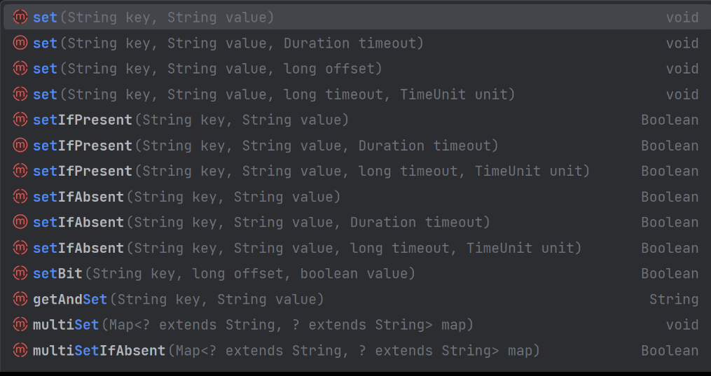

# 简介
个人Redis和RedisTemplate的练习项目 
语雀文档：https://www.yuque.com/wzzz/redis/sqr68zgovc6z7z90/edit
# redis中的数据类型
## string
RedisTemplate中的string操作api如下图所示：
具体的练习代码在TestStringRedisApplicationTest.java文件中

## list

## set

## zset

## hash

## geo

## hyperloglog

## bitmap

